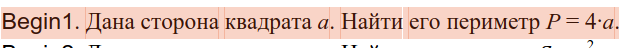

Данный код работает как калькуятор, который высчитывает периметр

входные данные: переменная а(сторона квадрата)
выходные данные: периметр квадрата со стороной а

после запуска кода введите значение а, и вам выведется значение периметра в следующей строке