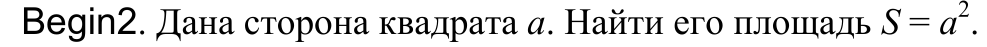

Данный код работает как калькуятор, который высчитывает площадь квадрата

входные данные: переменная а(сторона квадрата)
выходные данные: площадь квадрата со стороной а

после запуска кода введите значение а, и вам выведется значение площади в следующей строке