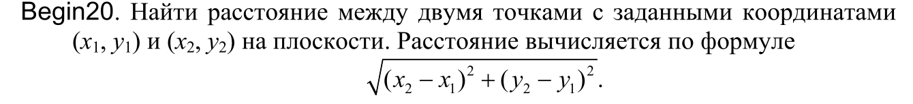

калькулятор высчитывающий расстояние между двумя точками с заданными координатами
(x1, y1) и (x2, y2)
входные данные: точки с заданными координатами (x1, y1) и (x2, y2)
выходные данные:расстояние между двумя точками
