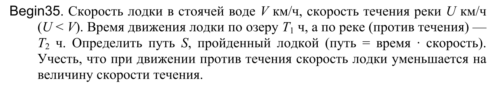

калькулятор высчитывающий Определить путь S, пройденный лодкой
входные данные: Скорость лодки в стоячей воде V км/ч, скорость течения реки U км/ч(U < V). Время движения лодки по озеру T1 ч, а по реке (против течения) — T2 ч.
выходные данные:путь S
