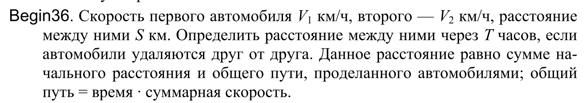

калькулятор высчитывающий расстояние между ними через T часов, если автомобили удаляются друг от друга
входные данные: Скорость первого автомобиля V1 км/ч, второго — V2 км/ч, расстояние между ними S км
выходные данные:расстояние между автомобилями

